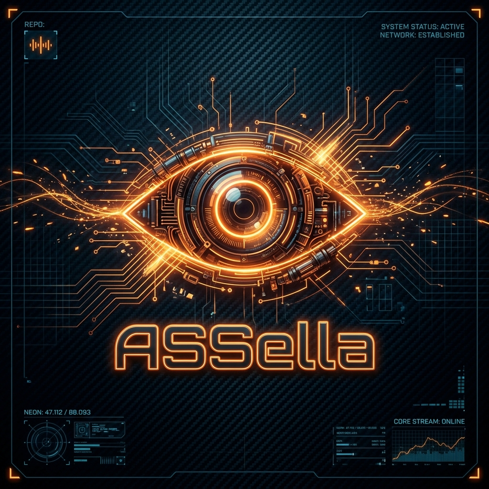

# ASSella

**ASSella** is a personal fork of ACCELA — a Steam game downloader / launcher for Linux & Steam Deck — bundling critical features.



## Features & Changes

* **Workshop Downloader** bundled (`workshop_downloader_linux`)
* **Steamless AIO** bundled (`steamless-aio.sh`)

## Installation (Steam Deck / Linux)

You can install or patch an existing ACCELA installation to ASSella automatically with this one-liner command:

```bash
curl -sL https://raw.githubusercontent.com/niwia/ASSella/main/install.sh | bash
```

This script:
1. Automatically backs up your original `ACCELA.AppImage` to `ACCELA.AppImage.bak`.
2. Downloads and sets up the latest `ASSella.AppImage`.
3. Patches your existing desktop applications menu shortcut and icon to show the custom **ASSella** branding and logo.

---

*ＧｏＤ_Ｉｓ_ｉＮ_ｔＨｅ_ＷｉＲｅＤ*
